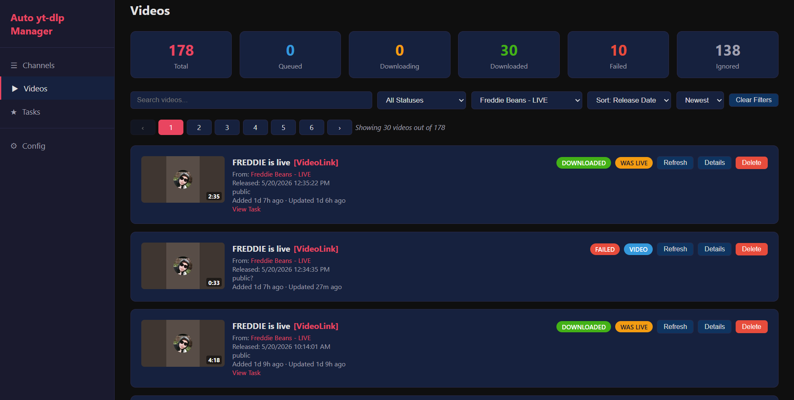

# auto-ytdlp-manager

Simple web ui program for archiving videos, and downloading YouTube livestreams in real time!

I really only built this for myself because I needed something that supports yt-dlp and ytarchive at the same time.

Even though this is a web ui, you shouldn't host this program outside of your local network. I plan on adding a simple password authentication system to remove this problem.

This program is in really early alpha, expect bugs...

**This is currently a windows only program!!**
_(You might be able to build from source on other platforms, although I haven't tested if this program works on platforms other than windows. (swoon))_

# Installation

Download autoytdlpmanager-windows.zip from the [latest release](https://github.com/hstf04233/auto-ytdlp-manager/releases/latest)

Extract the contents of autoytdlpmanager-windows.zip into a new folder then run autoytdlpmanager.exe
The program should open and tell you where the server is being hosted, by default it's localhost:8867 (The server port can be changed in config.json)

config.json is created after you run autoytdlpmanager.exe the first time.
Editing config.json while the program is running does not reload the config. Please just edit the config in the web ui config tab or restart the program for changes to apply.

If the program closes after a few seconds (or it closes instantly) then you might have missing dependencies. Read the program log (log_current.log) to confirm.

# Dependencies

This program depends on:
- yt-dlp ([github.com/yt-dlp/yt-dlp](https://github.com/yt-dlp/yt-dlp))
- ytarchive ([This forked version by dreammu specificly](https://github.com/dreammu/ytarchive))
- ffmpeg (and ffprobe) ([ffmpeg.org/download.html](https://ffmpeg.org/download.html), I recommend the builds from [gyan.dev/ffmpeg/builds/](https://www.gyan.dev/ffmpeg/builds/))

Although it's supported to just put these dependencies straight into the program's directory,
it's recommended that you add these to your system path environment!
If you need, you can edit the paths yourself in config.json

